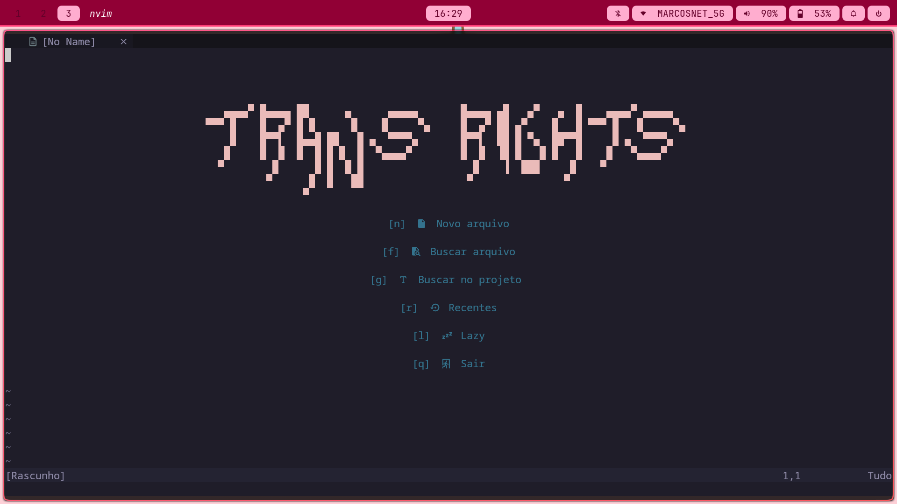

# Config "minimalista" da Bea ;)
Não é lá exatamente mínima, mas adicionei só o que uso com muita frequência em IDEs.

**Versão (Neovim):** 0.11.6   
**Gerenciador de plugins:** Lazy.nvim  
**S.O.:** Arch Linux

### Notas importantes!
1. Atualmente, as LSPs estão todas sendo gerenciadas pela **API nativa do Neovim**. Sem mais lspconfig, pois prefiro o mínimo externo possível, e a nova API é excelente.
2. O Treesitter, essencial pra análise sintática do código, mudou algumas dependências na versão mais recente. Caso não funcione, cheque o repositório oficial deles pra ver quais pacotes faltam!

## LSPs
- Lua
- Javascript/Typescript
- C e C++
- Rust
- Go
- Python

## Remaps

| Atalho        | Modo        | Origem        | Descrição |
|--------------|------------|--------------|----------|
| `<leader>..` | Normal     | Core         | Abre o explorador de arquivos (Ex / netrw). |
| `<leader>d`  | Normal/Visual | Core      | Deleta sem copiar para o clipboard (registro "_"). |
| `<leader>dd` | Normal     | Core         | Deleta a linha inteira sem copiar para o clipboard. |
| `<leader>e`  | Normal     | LSP          | Mostra diagnóstico em popup flutuante. |
| `<leader>q`  | Normal     | LSP          | Lista todos os erros do buffer (location list). |
| `<F2>`       | Normal     | LSP          | Renomeia símbolo (variável, função, etc.). |
| `gr`         | Normal     | LSP          | Mostra referências do símbolo. |
| `<leader>o`  | Normal     | aerial.nvim  | Abre/fecha a sidebar de estrutura do código. |
| `{`          | Normal     | aerial.nvim  | Vai para o símbolo anterior (função, classe, etc.). |
| `}`          | Normal     | aerial.nvim  | Vai para o próximo símbolo. |
| `<CR>`       | Insert     | blink.cmp    | Confirma autocomplete. |
| `<Tab>`      | Insert     | blink.cmp    | Seleciona próxima sugestão. |
| `<S-Tab>`    | Insert     | blink.cmp    | Seleciona sugestão anterior. |
| `<Esc>`      | Insert     | blink.cmp    | Cancela autocomplete. |
| `<C-\>`      | Normal     | toggleterm   | Abre/fecha terminal flutuante. |

## Plugins

| Plugin            | Descrição |
|------------------|----------|
| Comment.nvim     | Plugin para comentar e descomentar código rapidamente com atalhos, suportando diversos formatos de linguagem. |
| aerial.nvim      | Exibe uma visão estrutural do código (funções, classes, etc.) como uma sidebar, facilitando navegação. |
| blink.cmp        | Engine de autocomplete leve e rápida para Neovim, focada em performance e simplicidade. |
| bufferline.nvim  | Mostra os buffers abertos em formato de abas, permitindo navegação visual entre arquivos. |
| conform.nvim     | Formatador de código assíncrono, com suporte a múltiplos formatadores por linguagem. |
| mason.nvim       | Gerenciador de ferramentas externas (LSP, linters, formatters), facilitando instalação e configuração. |
| nvim-autopairs   | Insere automaticamente pares de caracteres como (), {}, [], "", etc. |
| nvim-lint        | Integra linters ao Neovim para análise de código e exibição de erros/avisos. |
| nvim-treesitter  | Fornece parsing avançado de código para highlight, indentação e análise sintática mais precisa. |
| nvim-web-devicons| Adiciona ícones a arquivos e interfaces (como telescope e bufferline). |
| plenary.nvim     | Biblioteca de utilidades em Lua usada como dependência por vários plugins. |
| rose-pine        | Tema elegante e minimalista para Neovim com foco em cores suaves. |
| telescope.nvim   | Ferramenta de busca fuzzy altamente extensível para arquivos, buffers, grep, etc. |
| toggleterm.nvim  | Gerencia terminais embutidos no Neovim, permitindo abrir/fechar facilmente. |

É isso, espero que essa config ajude alguém. Qualquer coisa, contactar por email:  
📧 `beatriz.csouza.rj@gmail.com`
